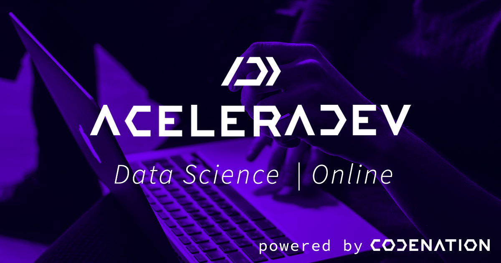

</img>

> Neste repositório está contido a minha trajetória no Curso de Data Science online e gratuito disponibilizado pela Codenation com o apoio das empresas CI&T, Conta Azul, Guia Bolso, PagueVeloz, Rocket.Chat, Sanar, Nexfar, Senior, Voyager e Itaú.  

Para maiores informações e novas turmas de acelerações basta entrar em: https://www.codenation.dev/

### Plano de aulas 

* Semana 1
    * Introdução a ciência de dados
* Semana 2
    * Manipulação de dados 
* Semana 3
    * Análise de dados exploratória
* Semana 4
    * .
